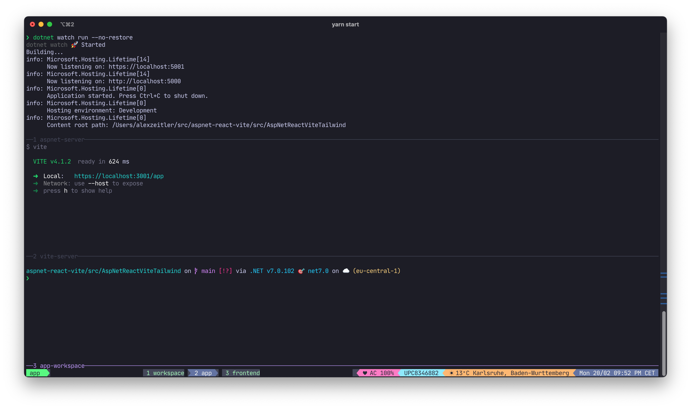
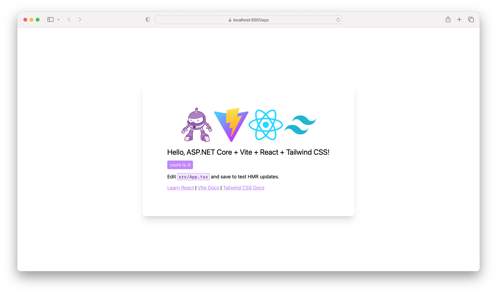

# ASP.NET Core + React + vite + Tailwind CSS template

Template based on this [blog post](https://blog.codeinside.eu/2023/02/11/aspnet-core-react-with-vitejs/).

## Usage

### After first checkout

```bash
yarn
cd src/AspNetReactViteTailwind
dotnet restore
cd ui
yarn
```

### Starting dev environment

```bash
# from repository root folder
yarn start
```

This will bring up a `tmux` window with panes for the ASP.NET Server and the `vite` dev server.



ASP.NET will open <https://localhost:5001/> in your default browser.

Then browse to <https://localhost:5001/app>:



## Known issues

* Not tested on Windows
* JetBrains Rider code completion does not work for TailwindCSS 3 JIT mode in `.cshtml` files [currently](https://youtrack.jetbrains.com/issue/RIDER-58725).

## Renaming solution / project / folders

Of course, you want to rename the projects files to match our needs.

You can use these commands, e.g. `AspNetReactViteTailwind`  gets renamed to `MyApp`:

### Rename all references inside the files

#### macOS

```shell
LC_ALL=C find . -type f -name '*.*' -not \( -path './node_modules/*' -o -path './src/AspNetReactViteTailwind/node_modules/*' -o -path './assets' \) -exec sed -i '' 's|AspNetReactViteTailwind|MyApp|g' {} \;
```

#### Linux

```shell
LC_ALL=C find . -type f -name '*.*' -not \( -path './node_modules/*' -o -path './src/AspNetReactViteTailwind/node_modules/*' -o -path './assets' \) -exec sed -i 's/AspNetReactViteTailwind/MyApp/g' {} \;
```

### Rename files and folders

#### macOS and Linux

```bash
find . -depth -name "*AspNetReactViteTailwind*" | \
while IFS= read -r ent; do mv $ent ${ent%AspNetReactViteTailwind*}MyApp${ent##*AspNetReactViteTailwind}; done

```
